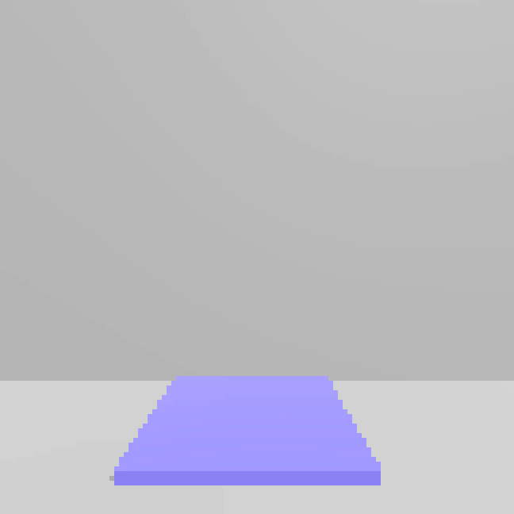
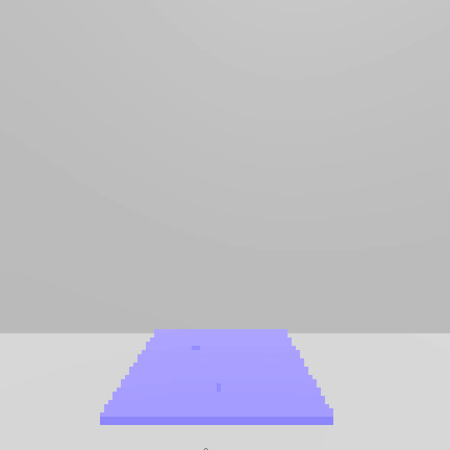
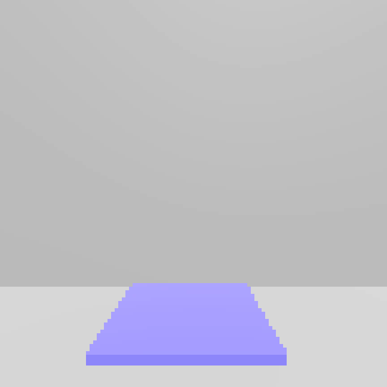

# 🕹️ Godot 3D - Interactive Tiles

Modular base for a first-person Godot 3D game with customizable interactive tiles and unique inventory mechanics. 

*Feel free to use as a starting point for your project!*

- [Contents](#includes)
- [Showcase](#simple-example)
- [Inventory](#inventory-system)
- [Quick start](#quick-start)

## Includes

- Interactive tiles system *- with fully customisable behaviors ([simple example](#interactions-showcase))*
- Unique inventory system - *with smooth animations ([details](#inventory-system))*
- Pixelation shader *- for easy retro visuals*
- Simple first-person controls
- Basic progression save system
- Clean signal-based code

## Simple Example

Here's a very basic example of what you can do with just one type of custom tile behavior, this tile will destroy any objects that activate it:

| GIF | Desc | Potential Uses |
|-|-|-|
|  | Object is dropped on a tile to activate it → gets destroyed by the tile's custom behavior script | "Lava" tiles that kill player unless they sacrifice an item |
|  | Multiple objects destroyed one-by-one | Pressure plates that stay active while items remain, like a fire burning until out of fuel |
|  | Tile is held activated using a script → script stops → object on top is destroyed | Temporary bridges/gates that disappear/close after time |
|  | Tile is forced into activated state via script → first object is removed → as a result, tile updates → item on top gets destroyed | Let the player choose to keep one of two bonus items / Create paths that close after the player walked on them (like one-way doors or no-retrace mazes) |

Script for the shown tile behavior:
```js
extends Tile

func _on_just_pressed(object_pressing: Object) -> void:
	object_pressing.queue_free()
	$ActivationParticles.emitting = true
```

> [!NOTE]
> Tiles store references to all the objects on top of them (which you can use for custom behaviors). But by default only one object at a time is considered to be the one currently activating the tile (holding it down). 

## Inventory System

The items can be stored into inventory by:
1. Action hotkeys *(E by default, when hovering onto an item in range)*
2. Being drag & dropped in *(by default above player's head)*

All the items stored in inventory will slowly float in circle on top of the player (and smoothly follow them).<br>
You can hide the inventory when its not active, so the items dont abstract the sky view.<br>
And you can also lower the inventory's position for easier items access via hotkeys (just like opening the inventory).

> [!TIP]
> All parameters used for the inventory logic can be found & changed at the top of the `/scripts/player.gd` script.

## Why Use This?
- Already handles the annoying stuff (item management, save system)
- Clean signal-based architecture (means easy extension and custom behaviors)
- All core systems are implemented and tested
- Easy to reskin for your own game

## Quick Start

1. Clone this repository
2. Open in Godot 4.x (tested with 4.3)
3. Run `scenes/demo.tscn` to see the demo level

To create new tile types:
1. Duplicate any of existing tiles from `/objects/tiles/` or extend from the `/objects/tile.tscn`
2. Modify the assigned script to create custom behaviors (use signals provided by the parent object)

## License
MIT - use however you want (credit appreciated but not required)